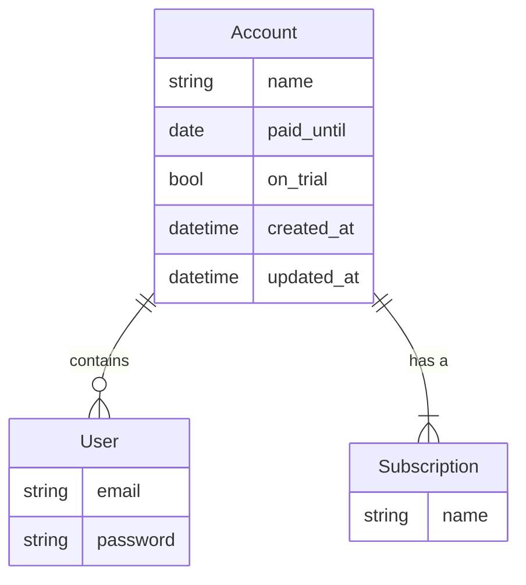

# User model
This section describes how the User models ties together in the completed system.

## ORD

```mermaid
erDiagram
    Account {
        string name
        date paid_until
        bool on_trial
        datetime created_at
        datetime updated_at
    }
    User {
        string email
        string password
    }
    Subscription {
        string name
    }
    Account ||--o{ User : contains
    Account ||--|{ Subscription : "has a"
```